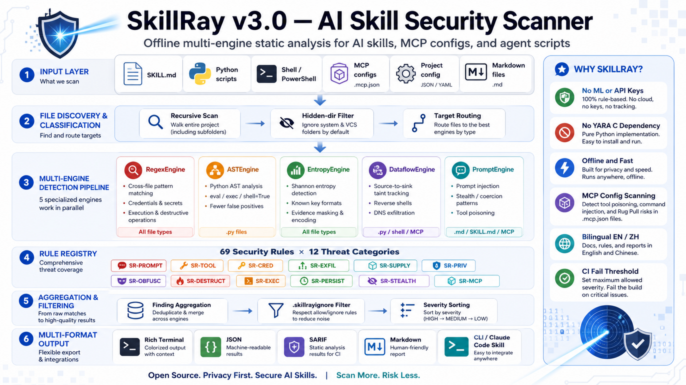

<p align="center">
  <h1 align="center">SkillRay</h1>
  <p align="center">
    <strong>AI Skill Security Scanner</strong>
    <br />
    Scan AI skills for security threats before they scan your secrets.
  </p>
  <p align="center">
    <a href="README.zh.md">中文</a>
  </p>
</p>

<p align="center">
  
  
  
  
</p>

---

## Why SkillRay?

**36.82% of AI skills contain security defects** (Snyk ToxicSkills). 30+ CVEs filed against MCP in 2025-2026. As AI agents gain tool-use capabilities, a single malicious skill can steal credentials, exfiltrate data, poison agent memory, or compromise entire systems.

SkillRay is a **lightweight, offline, multi-engine static analyzer** purpose-built for AI skill and MCP tool security — no ML models, no API keys, no YARA C dependencies.

## Features

- **5 Detection Engines** — Regex, AST, Entropy, Dataflow, Prompt analysis
- **69 Security Rules** across 12 threat categories
- **MCP Config Scanning** — Detects tool poisoning, command injection, and rug pull risks in `.mcp.json`
- **Stealth Detection** — Catches "do not tell the user" coercion patterns (top malicious skill indicator)
- **Persistence Detection** — CLAUDE.md poisoning, SSH key injection, cron backdoors
- **5-Level Severity** — Critical / High / Medium / Low / Info
- **Beautiful Terminal Output** — Rich tables, colors, progress indicators
- **Multiple Output Formats** — Text, JSON, SARIF, Markdown
- **Claude Code Skill** — Native integration as a Claude Code skill
- **Bilingual** — English and Chinese output (`--lang zh`)
- **Zero ML Dependencies** — Only requires `rich` (~3MB)
- **Offline & Fast** — No API calls, scans in milliseconds

## Architecture

<p align="center">
  
</p>

## Quick Start

```bash
# Install
pip install skillray
# or
uvx skillray

# Scan current directory
skillray .

# Scan with CI fail threshold
skillray ./skills --fail-on high

# JSON output for automation
skillray . --format json --output report.json

# Chinese output
skillray . --lang zh
```

## Threat Categories

| Category | Rules | Engine | Example Threats |
|----------|-------|--------|----------------|
| **SR-PROMPT** | 8 | Prompt | Hidden instructions, role override, invisible Unicode, Tags block, ANSI escape |
| **SR-TOOL** | 3 | Prompt | Tool poisoning, MCP override, hidden behaviors |
| **SR-CRED** | 9 | Entropy + Regex | Hardcoded keys, env var theft, crypto wallets, browser/cloud creds |
| **SR-EXFIL** | 8 | Dataflow + Regex | Reverse shells, DNS subdomain exfil, webhook exfil, image URL exfil |
| **SR-SUPPLY** | 6 | Regex + AST | Typosquatting, runtime installs, postinstall hooks |
| **SR-PRIV** | 4 | Regex | sudo, container escape, security bypass |
| **SR-OBFUSC** | 8 | Regex + Prompt | Base64/hex/ROT13/XOR payloads, homoglyphs, multi-layer encoding |
| **SR-DESTRUCT** | 3 | Regex | rm -rf, disk format, git history destruction |
| **SR-EXEC** | 4 | AST + Regex | eval/exec, shell=True, download-and-execute |
| **SR-PERSIST** | 6 | Regex | CLAUDE.md poisoning, SSH key injection, cron jobs, shell profile mods |
| **SR-STEALTH** | 5 | Prompt + Regex | "Do not tell user", output suppression, log clearing, anti-detection |
| **SR-MCP** | 5 | Prompt + Regex | Cross-tool shadowing, dangerous flags, command injection, rug pull |

## Detection Engines

| Engine | Target Files | Dependencies | Purpose |
|--------|-------------|-------------|---------|
| **RegexEngine** | All | stdlib `re` | Pattern matching (~100 patterns) |
| **ASTEngine** | `.py` | stdlib `ast` | Python AST analysis, eliminates comment/string FPs |
| **EntropyEngine** | All | stdlib `math` | Shannon entropy + ~15 known key formats |
| **DataflowEngine** | `.py` / shell / MCP config | stdlib | Taint tracking + reverse shell + DNS exfil |
| **PromptEngine** | `.md` / SKILL.md / MCP config | stdlib | Prompt injection, stealth, tool shadowing |

## CLI Reference

```
skillray [PATH]                      # Positional arg, default "."
  --format text|json|sarif|md        # Output format
  --output FILE                      # Write report to file
  --fail-on critical|high|medium|low # Exit code threshold (for CI)
  --quiet                            # Minimal output
  --lang en|zh                       # Language
  --ignore-file PATH                 # Ignore config file
  --engines regex,ast,entropy,...    # Select engines
  --rules SR-PROMPT-*,SR-CRED-*     # Filter rules
  --no-color                         # Disable colors
  --version
```

## Comparison

| Feature | SkillRay | AgentVet | Cisco Scanner |
|---------|----------|----------|---------------|
| External deps | `rich` only | YARA + multiple | YARA + LLM |
| Detection engines | 5 | 3 | 3 |
| Prompt injection | Dedicated engine | No | LLM-based |
| AST analysis | Yes | No | No |
| Entropy analysis | Yes | No | No |
| Claude Code Skill | Native | No | No |
| Offline | Yes | Yes | No (needs LLM) |
| Chinese support | Yes | No | No |

## Claude Code Skill

SkillRay works as a native Claude Code skill. After installation, just say:

> "Scan this directory for security issues"

The `SKILL.md` in the project root enables Claude Code to automatically invoke SkillRay and present findings conversationally.

## Ignore Rules (`.skillrayignore`)

```text
# Ignore a rule globally
SR-PRIV-001

# Ignore a rule for specific files
SR-CRED-001:tests/**/*.py
```

## Development

```bash
# Clone and install
git clone https://github.com/MRT-8/SkillRay
cd skillRay
uv sync

# Run tests
uv run pytest tests/ -v

# Run scanner on test samples
uv run python3 -m skillray tests/samples/malicious/
uv run python3 -m skillray tests/samples/benign/
```

## License

Apache-2.0
